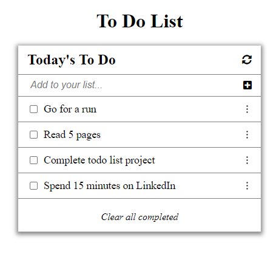

# TO-DO LIST APP

>This app allows users to organize their task efficiently. They can do by making changes 
(adding, editing and removing to-do items) to the list.

## Preview

## Built With

- HTML
- CSS
- JavaScript
- Webpack

### To get a local copy, run the following steps:

- Clone the repository with `git@github.com:BenjaminSemah/BVS-ToDo-ListApp.git`
- Open the folder with your code editor
- Run `npm install` to install all dependencies
- Run `npm start` and go to `http://localhost:8080//` to launch the server.

### AUTHOR

👤 **Benjamin Semah**

- GitHub: [Benjamin Semah](https://github.com/BenjaminSemah)
- Twitter: [Benjamin Semah](https://twitter.com/BenjaminSemah)
- LinkedIn: [Benjamin Semah](https://www.linkedin.com/in/benjaminsemah/)

## Show your support

Give a ⭐️ if you like this project!